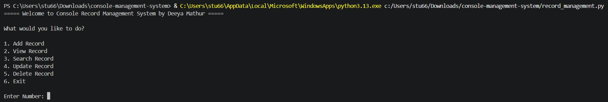
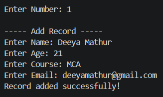
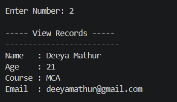
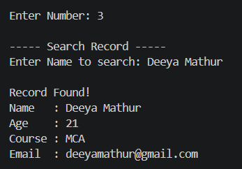
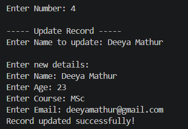
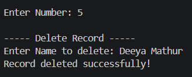
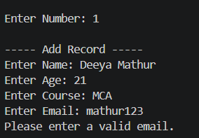
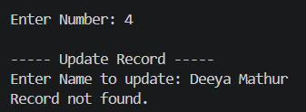
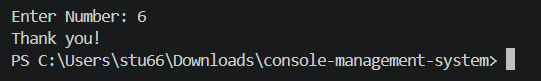

# Console Record Management System

## Project Description

The Console Record Management System is a menu-driven Python application developed to manage records through the console.

The application allows users to add, view, search, update, and delete records. The records are stored in a CSV file named `records.csv`, allowing the data to remain stored even after the program is closed.

This project demonstrates important Python programming concepts such as data types and variables, conditional statements, loops, functions, exception handling, and File I/O.

## Features

- Add new records
- View all records
- Search records by name
- Update existing records
- Delete existing records
- Store records in a CSV file
- Menu-driven console interface
- Validate name and course input
- Validate age input
- Basic email validation
- Handle invalid menu input
- Handle missing record files
- Handle file-related errors
- Case-insensitive record searching

## Technologies Used

| Technology   | Purpose                          |
|--------------|-----------------------------------|
| Python 3     | Application development          |
| `csv` module | Reading and writing CSV records  |
| CSV file     | Data storage                     |
| Command Line | User interface                   |
| GitHub       | Source code management           |

## Python Concepts Used

### 1. Data Types and Variables

The application uses different Python data types and variables, including:

- **String**: Used for name, course, and email.
- **Integer**: Used for age and menu choices.
- **List**: Used to temporarily store records during update and delete operations.
- **Boolean**: Used to track whether a record has been found.

### 2. Conditional Statements

The program uses `if`, `elif`, and `else` statements to make decisions based on user input.

The main menu uses conditional statements to determine which operation the user wants to perform.

```python
if n == 1:
    add_record()

elif n == 2:
    view_record()

elif n == 3:
    search_record()

elif n == 4:
    update_record()

elif n == 5:
    delete_record()

elif n == 6:
    print("Thank you!")
    break

else:
    print("Invalid choice. Please enter a number from 1 to 6.")
```

### 3. Loops

The application uses loops to repeatedly display the menu and process records.

The `while` loop keeps the application running until the user selects the Exit option.

```python
while True:
    print("Console Record Management System")
```

`for` loops are used to read and process records stored in the CSV file.

### 4. Functions

The application is divided into separate functions for different record management operations.

- `add_record()`
- `view_record()`
- `search_record()`
- `update_record()`
- `delete_record()`

Each function performs a specific task, making the program easier to understand and maintain.

### 5. Exception Handling

The application uses `try-except` blocks to handle invalid input and file-related errors.

For example, invalid age input is handled using `ValueError`.

```python
try:
    age = int(input("Enter Age: "))

    if age <= 0:
        print("Age must be greater than 0.")
        return

except ValueError:
    print("Please enter a valid age.")
    return
```

The program also handles file-related errors such as a missing `records.csv` file and other operating system errors.

### 6. File I/O

File I/O is used to store records permanently.

The application uses three file modes:

| Mode | Purpose                                       |
|------|------------------------------------------------|
| `a`  | Add records to the CSV file                    |
| `r`  | Read records from the CSV file                 |
| `w`  | Rewrite the file after updating or deleting records |

The records are stored in `records.csv`.

### 7. CSV Module

The built-in Python `csv` module is used to read and write records.

Each record contains four fields: `Name, Age, Course, Email`

Example:

```
Deeya Mathur,22,MCA,deeya@example.com
```

## Application Menu

When the application starts, the following menu is displayed:

```
===== Console Record Management System by Deeya Mathur =====

What would you like to do?

1. Add Record
2. View Record
3. Search Record
4. Update Record
5. Delete Record
6. Exit
```

## How to Run the Application

### Requirements

- Python 3.x
- Git, if cloning the repository

No external Python packages are required. The application only uses Python's built-in `csv` module.

### Step 1: Clone the Repository

```bash
git clone YOUR_GITHUB_REPOSITORY_URL
```

### Step 2: Open the Project Folder

```bash
cd Console-Record-Management-System
```

### Step 3: Run the Application

```bash
python record_management.py
```

If your system uses `python3`, run:

```bash
python3 record_management.py
```

The application will start in the console.

The `records.csv` file will be created automatically when the first record is added.

## Sample Input and Output

### Add Record

```
----- Add Record -----

Enter Name: Deeya Mathur
Enter Age: 22
Enter Course: MCA
Enter Email: deeya@example.com

Record added successfully!
```

### View Records

```
----- View Records -----

-------------------------
Name   : Deeya Mathur
Age    : 22
Course : MCA
Email  : deeya@example.com
```

### Search Record

```
----- Search Record -----

Enter Name to search: Deeya Mathur

Record Found!
Name   : Deeya Mathur
Age    : 22
Course : MCA
Email  : deeya@example.com
```

### Update Record

```
----- Update Record -----

Enter Name to update: Deeya Mathur

Enter new details:

Enter Name: Deeya Mathur
Enter Age: 23
Enter Course: MCA
Enter Email: deeya@example.com

Record updated successfully!
```

### Delete Record

```
----- Delete Record -----

Enter Name to delete: Deeya Mathur

Record deleted successfully!
```

### Exit

```
Thank you!
```

## Error Handling Examples

**Invalid Age**
```
Enter Age: abc
Please enter a valid age.
```

**Negative Age**
```
Enter Age: -5
Age must be greater than 0.
```

**Empty Name**
```
Enter Name:
Name cannot be empty.
```

**Empty Course**
```
Enter Course:
Course cannot be empty.
```

**Invalid Email**
```
Enter Email: deeya
Please enter a valid email.
```

**Invalid Menu Input**
```
Enter Number: abc
Please enter a number from 1 to 6.
```

**Invalid Menu Choice**
```
Enter Number: 8
Invalid choice. Please enter a number from 1 to 6.
```

## Project Structure

```
Console-Record-Management-System/
|
|-- record_management.py
|-- records.csv
|-- README.md
|
`-- screenshots/
    |-- main_menu.png
    |-- add_record.png
    |-- view_records.png
    |-- search_records.png
    |-- update_record.png
    |-- delete_record.png
    |-- invalid_email.png
    |-- unknown_record.png
    `-- exit_console.png
```

## GitHub Repository Details

- **Repository Name:** Console-Record-Management-System
- **Author:** Deeya Mathur
- **Course:** MCA Semester I
- **Subject:** Python Programming & Relational Database
- **Assignment:** Assignment 1 - Mini Project
- **Repository Link:** YOUR_GITHUB_REPOSITORY_URL

## Screenshots

- Main menu
  


- Add Record
  


- View Records
  


- Search Record
  


- Update Record
  


- Delete Record
  


- Invalid input handling
  



- Exit Console
  


## Assignment Requirements

| Requirement              | Implementation                              |
|---------------------------|----------------------------------------------|
| Data Types and Variables  | Strings, integers, lists and Boolean variables |
| Conditional Statements    | `if`, `elif` and `else`                      |
| Loops                     | `while` and `for` loops                      |
| Functions                 | Separate functions for each operation        |
| Exception Handling        | `try-except` blocks                          |
| File I/O                  | Reading and writing `records.csv`            |
| Menu-driven Application   | Console-based six-option menu                |
| Add Records               | `add_record()`                               |
| View Records              | `view_record()`                              |
| Search Records            | `search_record()`                            |
| Update Records            | `update_record()`                            |
| Delete Records            | `delete_record()`                            |

## Conclusion

The Console Record Management System demonstrates the practical use of fundamental Python programming concepts in a single working application.

The application provides basic record management functionality through a menu-driven console interface. Records are stored in a CSV file using Python's built-in `csv` module, allowing the data to be retained between program executions.

The project covers the required concepts of data types and variables, conditional statements, loops, functions, exception handling, File I/O, and menu-driven application design.
